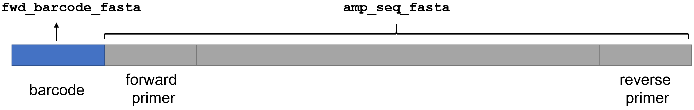
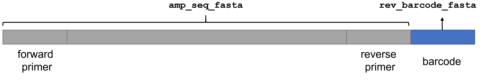
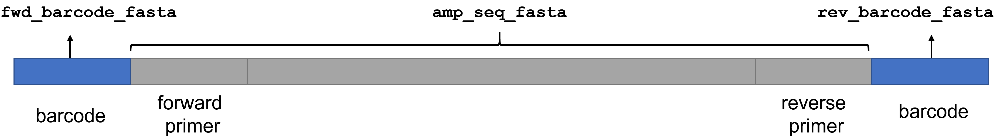
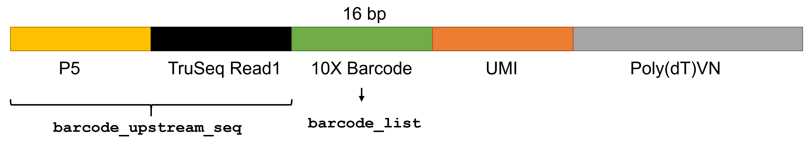

# NanoBinner: A demultiplexing tool for Oxford Nanopore long-read sequencing data. 

## Features
- NanoBinner uses the sequence upstream/downstream of the barcode (i.e. anchor) to help locate barcode position and eliminates random matching due to sequencing error.
- NanoBinner does not require a pretrained model for demultiplexing and supports officially provided barcodes as well as custom-designed barcodes.
- NanoBinner is able to demultiplex Oxford Nanopore sequencing data generated from **10X Genomics Chromium Single Cell 3ʹ Gene Expression Libraries**. 

## Table of Contents

- [Requirements](#Requirements)
- [Installation](#Installation)
- [Usage](#Usage)
  - [Quick start](#Quick_start)
  - [Demultiplexing regular amplicons](#Demultiplexing_regular_amplicons)
    - [Case 1: The barcode is next to the forward primer](#case1)
    - [Case 2: The barcode is next to the reverse primer](#case2)
    - [Case 3: The barcodes are on both ends. One sample have the same barcodes on both ends. Only one barcode is required to bin the reads.](#case3)
    - [Case 4: The barcodes are on both ends. One sample may or may not have the same barcodes on both ends. Two barcodes are required to bin the reads.](#case4)
  - [Demultiplexing 10X Genomics Chromium Single Cell 3ʹ Gene Expression Libraries](#tenx)


## <a name="Requirements"></a>Requirements
- Operating system: Linux or macOS
- [Python](https://www.python.org/) 2.7 or later
- [minimap2](https://github.com/lh3/minimap2) 2.8 or later

## <a name="Installation"></a>Installation

NanoBinner calls `minimap2` to do sequence alignment. If you don't have `minimap2` in your system, you can install it following the instructions [here](https://github.com/lh3/minimap2#install).  
If you are using Linux, you can acquire precompiled binaries using the following commands:

```
wget https://github.com/lh3/minimap2/releases/download/v2.17/minimap2-2.17_x64-linux.tar.bz2
tar -jxvf minimap2-2.17_x64-linux.tar.bz2
./minimap2-2.17_x64-linux/minimap2
```

Next, you can clone the repository of NanoBinner using the following command.
```
git clone https://github.com/WGLab/NanoBinner.git
```
The scripts in the `./NanoBinner` can run directly without additional compilation or installation.

## <a name="Usage"></a>Usage

There are two script files in the `NanoBinner` directory. `nanoBinner_10X.py` is used to demultiplex Oxford Nanopore sequencing data derived from 10X Genomics Chromium single cell libraries. There are usually several thousands of barcodes per sample.  `nanoBinner.py` is for regular barcoding methods, including barcoding kits provided by Oxford Nanopore Technologies and custom-designed barcodes.

### <a name="Quick_start"></a> Quick start

```
# The barcode is beside forward primer
path/to/NanoBinner/nanoBinner.py --in_fq example_data.fastq.gz --amp_seq_fasta example_amplicon_seq.fasta --out_dir . --exp_name testing --num_threads 4 --fwd_barcode_fasta example_barcodes.fasta --minimap2 path/to/minimap2

# The barcode is beside reverse primer
path/to/NanoBinner/nanoBinner.py --in_fq example_data.fastq.gz --amp_seq_fasta example_amplicon_seq.fasta --out_dir . --exp_name testing --num_threads 4 --rev_barcode_fasta example_barcodes.fasta --minimap2 path/to/minimap2

# The barcodes are on both ends. One sample have the same barcodes on both ends. Only one barcode is required to bin the reads.
path/to/NanoBinner/nanoBinner.py --in_fq example_data.fastq.gz --amp_seq_fasta example_amplicon_seq.fasta --out_dir . --exp_name testing --num_threads 4 --fwd_barcode_fasta example_barcodes.fasta --rev_barcode_fasta example_barcodes.fasta --minimap2 path/to/minimap2

# The barcodes are on both ends. One sample may or may not have the same barcodes on both ends. Two barcodes are required to bin the reads.
path/to/NanoBinner/nanoBinner.py --in_fq example_data.fastq.gz --amp_seq_fasta example_amplicon_seq.fasta --out_dir . --exp_name testing --num_threads 4 --fwd_barcode_fasta example_barcodes.fasta --rev_barcode_fasta example_barcodes.fasta --require_two_barcodes --minimap2 path/to/minimap2

# Input DNA is from a 10X Genomics single cell library
/home/fangl/NanoBinner/nanoBinner_10X.py --in_fq example.fastq.gz --barcode_list barcodes.txt --barcode_upstream_seq AATGATACGGCGACCACCGAGATCTACACTCTTTCCCTACACGACGCTCTTCCGATCT --out_prefix testing --num_threads 8 
```

### <a name="Demultiplexing_regular_amplicons"></a> Demultiplexing regular amplicons

```
$ ./nanoBinner.py --help 
usage: nanoBinner.py [-h] [--in_fq FILE] [--in_fq_list FILE] --amp_seq_fasta
                    FILE --out_dir PATH --exp_name STRING
                    [--fwd_barcode_fasta FILE] [--rev_barcode_fasta FILE]
                    [--require_two_barcodes] [--num_threads INT]
                    [--minimap2 FILE] [--version]

A barcode demultiplexer for Oxford Nanopore long-read sequencing data

optional arguments:
  -h, --help            show this help message and exit
  --in_fq FILE          input sequencing reads in one FASTQ(.gz) file
  --in_fq_list FILE     a list file specifying all input FASTQ(.gz) files, one
                        file per line
  --amp_seq_fasta FILE  reference amplicon sequence in FASTA format
  --out_dir PATH        output directory
  --exp_name STRING     experimental name, used as prefix of output files
  --fwd_barcode_fasta FILE
                        barcode sequences of the forward primer (in FASTA
                        format)
  --rev_barcode_fasta FILE
                        barcode sequences of the reverse primer (in FASTA
                        format)
  --require_two_barcodes
                        require matched barcodes on both ends (default:
                        False). Notice: this option is valid only if both '--
                        fwd_barcode_fasta' and '--rev_barcode_fasta' are
                        supplied.
  --num_threads INT     number of threads (default: 1)
  --minimap2 FILE       path to minimap2 (default: using environment default)
  --version             show program's version number and exit

```
If you have one single input fastq file, you can supply the input with `--in_fq`. 
If you have multiple fastq files, you can supply a list file with `--in_fq_list`. The list file contains all input fastq files, one file per line. 

`--amp_seq_fasta` is the reference amplicon sequence in FASTA format. Sometimes the barcode sequence is not at the very begining of the long read. Sometimes the first a few bases of a read is truncated. Due to the sequencing error, the barcode matching is flexible and allows some mismatches. **`nanoBinner.py` assumes the reference amplicon sequence is known and uses it to distinguish amplicon sequence and barcode sequence, thus eliminates random fuzzy matching inside the amplicon.** 

`--fwd_barcode_fasta` and `--rev_barcode_fasta` are barcode sequences in FASTA format. If you use the same barcodes on both ends, you can supply `--fwd_barcode_fasta` and `--rev_barcode_fasta` with the same file. An example of `--fwd_barcode_fasta` is shown below. We supplied FASTA files of official barcodes in the `NanoBinner/ONT_barcodes` folder.  

```
>BC01
CACAAAGACACCGACAACTTTCTT
>BC02
ACAGACGACTACAAACGGAATCGA
>BC03
CCTGGTAACTGGGACACAAGACTC
>BC04
TAGGGAAACACGATAGAATCCGAA
>BC05
AAGGTTACACAAACCCTGGACAAG
```

`nanoBinner.py` supports different barcoding strategies.  
#### <a name="case1"></a> Case 1. The barcode is next to the forward primer

In this case, the amplicon structure is shown below. 
<p align="center"></p>

You can use the `--fwd_barcode_fasta` argument to supply the barcode FASTA file and use the `--amp_seq_fasta` argument to supply reference amplicon FASTA file. Please note that **the `--amp_seq_fasta` file should INCLUDE the primer sequence but EXCLUDE the barcode sequence**.  An example command is shown below: 

```
/home/fangl/NanoBinner/nanoBinner.py --in_fq example_data.fastq.gz --amp_seq_fasta example_amplicon_seq.fasta --out_dir . --exp_name testing --num_threads 4 --fwd_barcode_fasta example_barcodes.fasta --minimap2 /home/fangl/software/minimap2-2.8_x64-linux/minimap2
```

#### <a name="case2"></a> Case 2. The barcode is next to the reverse primer
In this case, the amplicon structure is shown below. 
<p align="center"></p>

Similar to case 1, you can use the `--rev_barcode_fasta` argument to supply the barcode FASTA file and use the `--amp_seq_fasta` argument to supply reference amplicon FASTA file. Please note that **the `--amp_seq_fasta` file should INCLUDE the primer sequence but EXCLUDE the barcode sequence**.  An example command is shown below: 

```
/home/fangl/NanoBinner/nanoBinner.py --in_fq example_data.fastq.gz --amp_seq_fasta example_amplicon_seq.fasta --out_dir . --exp_name testing --num_threads 4 --rev_barcode_fasta example_barcodes.fasta --minimap2 /home/fangl/software/minimap2-2.8_x64-linux/minimap2
```

#### <a name="case3"></a> Case 3. The barcodes are on both ends. One sample have the same barcodes on both ends. Only one barcode is required to bin the reads.
This might be the most common case. In this case, the amplicon structure is shown below. 
<p align="center"></p>

You can supply `--fwd_barcode_fasta` and `--rev_barcode_fasta` with the same file, and use the `--amp_seq_fasta` argument to supply reference amplicon FASTA file. Please note that **the `--amp_seq_fasta` file should INCLUDE the primer sequence but EXCLUDE the barcode sequence**.  An example command is shown below: 

```
/home/fangl/NanoBinner/nanoBinner.py --in_fq example_data.fastq.gz --amp_seq_fasta example_amplicon_seq.fasta --out_dir . --exp_name testing --num_threads 4 --fwd_barcode_fasta example_barcodes.fasta --rev_barcode_fasta example_barcodes.fasta --minimap2 /home/fangl/software/minimap2-2.8_x64-linux/minimap2
```

#### <a name="case4"></a> Case 4. The barcodes are on both ends. One sample may or may not have the same barcodes on both ends. Two barcodes are required to bin the reads.
This might be the most common case. In this case, the amplicon structure is shown below. 
<p align="center"></p>

You can supply `--fwd_barcode_fasta` and `--rev_barcode_fasta` with the barcode FASTA file. The `--fwd_barcode_fasta` and `--rev_barcode_fasta` file may or may not be the same. **You want to use the `--require_two_barcodes` option to specify that two barcodes are required to bin the reads.**  You can use the `--amp_seq_fasta` argument to supply reference amplicon FASTA file. Please note that **the `--amp_seq_fasta` file should INCLUDE the primer sequence but EXCLUDE the barcode sequence**.  An example command is shown below: 

```
/home/fangl/NanoBinner/nanoBinner.py --in_fq example_data.fastq.gz --amp_seq_fasta example_amplicon_seq.fasta --out_dir . --exp_name testing --num_threads 4 --fwd_barcode_fasta example_barcodes.fasta --rev_barcode_fasta example_barcodes.fasta --require_two_barcodes --minimap2 /home/fangl/software/minimap2-2.8_x64-linux/minimap2
```

### <a name="tenx"></a> Demultiplexing 10X Genomics Chromium Single Cell 3ʹ Gene Expression Libraries
A 10X Genomics Chromium Single Cell 3ʹ Gene Expression Library often has several thousands of cellular barcodes. NanoBinner uses the sequence upstream of the barcode to help locate barcode position and eliminates random matching due to sequencing error. We provided a separate script file `nanoBinner_10X.py` for 10X single cell libraries. The structure of the 10X Genomics single cell library is shown below. 
<p align="center"></p>

```
$ ./nanoBinner_10X.py --help 
usage: nanoBinner_10X.py [-h] [--in_fq FILE] [--in_fq_list FILE] --barcode_list
                        FILE --barcode_upstream_seq STRING --out_prefix PATH
                        [--num_threads INT] [--minimap2 FILE] [--version]

A barcode demultiplexer for Oxford Nanopore long-read sequencing data with 10X
Genomics Chromium barcodes

optional arguments:
  -h, --help            show this help message and exit
  --in_fq FILE          input sequencing reads in one FASTQ(.gz) file
  --in_fq_list FILE     a list file specifying all input FASTQ(.gz) files, one
                        file per line
  --barcode_list FILE   a list file of all barcode sequences, one barcode
                        sequence per line, no barcode name
  --barcode_upstream_seq STRING
                        known upstream sequence of the barcode
  --out_prefix PATH     prefix of output files
  --num_threads INT     number of threads (default: 1)
  --minimap2 FILE       path to minimap2 (default: using environment default)
  --version             show program's version number and exit
```

If you have one single input fastq file, you can supply the input with `--in_fq`. 
If you have multiple fastq files, you can supply a list file with `--in_fq_list`. The list file contains all input fastq files, one file per line. 

The barcode upstream sequence can be supplied with the `--barcode_upstream_seq` argument. It can be either the TruSeq Read1 sequence or the concatenation of the P5 sequence and the TruSeq Read1 sequence. 

The barcode list file is supplied via the `--barcode_list` argument. The barcode list file should contain all barcodes of the specific sample, one barcode sequence per line (No barcode name). An example of the barcode list file is shown below. 


```
AAACCCACACATCATG
AAACCCACATCATTGG
AAACCCAGTAGTTCCA
AAACCCAGTCGTTATG
AAACCCAGTGCGGATA
AAACCCAGTTCTTAGG
AAACCCATCATGAGTC
AAACCCATCTACTCAT
AAACGAAAGGTAGTAT
AAACGAACAACCCTAA
```

An example command is: 

```
/home/fangl/NanoBinner/nanoBinner_10X.py --in_fq example.fastq.gz --barcode_list barcodes.txt --barcode_upstream_seq AATGATACGGCGACCACCGAGATCTACACTCTTTCCCTACACGACGCTCTTCCGATCT --out_prefix testing --num_threads 8 
```

`nanoBinner_10X.py` will generate 3 files: `testing.demultiplexing.PASS.reads.txt`, `testing.demultiplexing.statistics.txt` and `testing.all_reads.txt`.

`testing.demultiplexing.PASS.reads.txt` contains the barcodes of QC-passed reads. 
`testing.all_reads.txt` contains the barcodes of all reads (including QC-passed and QC-failed reads). 
`testing.demultiplexing.statistics.txt` is a summary file with number of reads per barcode. 

#### Limitation
`nanoBinner_10X.py` has been tested samples with less than 10,000 barcodes. You'd better have a short-read 10X Genomics sequencing data so that you can narrow down the barcode list to a few thousand. `nanoBinner_10X.py` will not work well on a large barcode list (e.g. the complete barcode list which has > 1 million barcodes).  


